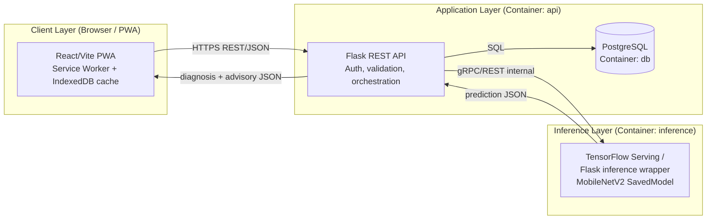
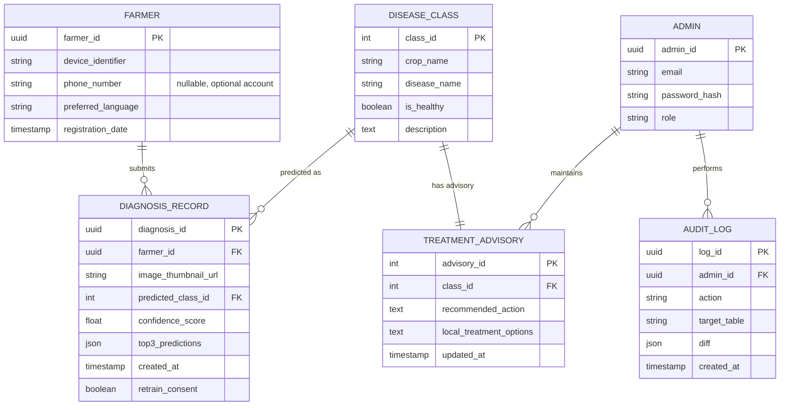

# Software Requirements Specification (SRS)
## AgroScan NG — Web-Based Crop Disease Detection System for Smallholder Farmers in Nigeria

**Based on:** *Design and Implementation of a Web-Based Crop Disease Detection System for Smallholder Farmers in Nigeria Using Convolutional Neural Networks* (TASUED Final Year Project, Chapters 1–5)
**Document type:** Engineering requirements specification for the build phase
**Status:** Draft v1.0

---

## Table of Contents

1. [Document Overview](#1-document-overview)
2. [Project Summary](#2-project-summary)
3. [Goals and Objectives](#3-goals-and-objectives)
4. [Scope](#4-scope)
5. [User Roles and Personas](#5-user-roles-and-personas)
6. [User Stories](#6-user-stories)
7. [Functional Requirements](#7-functional-requirements)
8. [Non-Functional Requirements](#8-non-functional-requirements)
9. [System Architecture](#9-system-architecture)
10. [Crop and Disease Classification Taxonomy](#10-crop-and-disease-classification-taxonomy)
11. [Machine Learning Specification](#11-machine-learning-specification)
12. [Data Model](#12-data-model)
13. [API Specification](#13-api-specification)
14. [Technology Stack](#14-technology-stack)
15. [Containerization and Deployment (Docker + Render)](#15-containerization-and-deployment-docker--render)
16. [Repository / Folder Structure](#16-repository--folder-structure)
17. [Security Requirements](#17-security-requirements)
18. [Testing Strategy](#18-testing-strategy)
19. [Implementation Roadmap](#19-implementation-roadmap)
20. [Acceptance Criteria / Definition of Done](#20-acceptance-criteria--definition-of-done)

---

## 1. Document Overview

This document translates the approved final year project research (Chapters 1–5) into a concrete engineering specification that a development team (or a solo student developer) can build directly against. It covers functional and non-functional requirements, user stories, the machine learning pipeline, the data model, the API contract, the technology stack, and the Docker-based deployment strategy targeting Render.

Every requirement in this document traces back to a decision already justified in the research paper (system architecture in Chapter 3, implementation approach in Chapter 4). Where the research paper described something at a conceptual level (e.g. "a REST API"), this document makes it concrete (e.g. exact endpoints, request/response shapes, status codes).

---

## 2. Project Summary

Nigerian smallholder farmers currently rely on manual visual inspection and delayed extension officer visits (5–7 days on average) to diagnose crop disease. AgroScan NG is a browser-based, installable-free Progressive Web Application (PWA) that lets a farmer photograph a diseased leaf and receive an AI-generated diagnosis and treatment recommendation within seconds, covering the five staple crops most affected by disease in Nigeria: **cassava, maize, yam, tomato, and rice**.

The system is built on a fine-tuned MobileNetV2 Convolutional Neural Network served through a dedicated inference API, wrapped by a Flask backend, and consumed by a Progressive Web Application frontend that works under low-bandwidth, intermittent-connectivity conditions typical of rural Nigeria.

---

## 3. Goals and Objectives

| # | Objective | Success Measure |
|---|-----------|------------------|
| G1 | Diagnose crop disease from a leaf photo in near real time | Median inference response < 5 seconds on 3G |
| G2 | Cover the 5 priority staple crops and their major diseases | ≥ 25 disease classes + healthy classes across 5 crops |
| G3 | Be usable without installing an app | Fully functional PWA, add-to-home-screen supported |
| G4 | Work acceptably on low-end Android devices and patchy networks | Offline caching of shell + last diagnosis; < 3MB initial payload |
| G5 | Give farmers actionable, plain-language treatment advice | Every disease class mapped to a treatment advisory record |
| G6 | Be maintainable/updatable without redeploying the whole app | Model service deployed and versioned independently of API/UI |
| G7 | Be deployable reproducibly | One-command Docker Compose local run; container-based deploy to Render |

---

## 4. Scope

### 4.1 In Scope
- Image-based disease classification for **cassava, maize, yam, tomato, rice** leaves.
- Web-based (PWA) client — mobile-first, desktop-compatible.
- REST API backend with diagnosis, history, and advisory endpoints.
- Model training pipeline (offline/notebook) + model serving pipeline (online).
- Admin capability to manage treatment advisory content.
- Diagnosis history per device/user (no mandatory account creation for farmers).
- Offline caching of the app shell and previously returned diagnoses.
- Dockerized local development and Docker-based deployment to Render.

### 4.2 Out of Scope (v1)
- Pest/insect detection requiring non-leaf images.
- Soil-borne disease diagnosis.
- Native mobile app (iOS/Android store builds).
- SMS/USSD channel integration (flagged as a Chapter 5 future-work recommendation — v2 candidate).
- Multi-language localization beyond English (v2 candidate; Yoruba/Hausa/Igbo strings can be added later without architecture change).

---

## 5. User Roles and Personas

| Role | Description | Access |
|------|-------------|--------|
| **Farmer (Primary User)** | Smallholder farmer diagnosing crops via smartphone or shared desktop/kiosk. No mandatory registration — identified by a device-scoped anonymous ID, with optional phone-based account for cross-device history. | Diagnose, view own history, view advisory content |
| **Administrator** | Departmental staff / project maintainer curating disease and treatment advisory content, and monitoring system health. | Full CRUD on `DiseaseClass` and `TreatmentAdvisory`, view aggregate usage analytics |
| **Extension Officer (v2 stretch role)** | Optional role for verified agricultural extension staff to review flagged low-confidence diagnoses. | Read diagnosis queue, annotate/correct results (feeds future retraining) |

---

## 6. User Stories

Stories use the standard `As a <role>, I want <capability>, so that <benefit>` format and are grouped by epic. Each maps to Functional Requirements in Section 7.

### Epic A — Image Capture & Diagnosis
- **US-A1**: As a farmer, I want to take a photo of a diseased leaf directly in the browser, so that I don't need a separate camera app.
- **US-A2**: As a farmer, I want to upload an existing photo from my gallery, so that I can diagnose a leaf I photographed earlier.
- **US-A3**: As a farmer, I want to select which crop I'm photographing before or after upload, so that the system can narrow its prediction confidence appropriately.
- **US-A4**: As a farmer, I want to see a loading indicator while my image is being analysed, so that I know the system is working, especially on slow connections.
- **US-A5**: As a farmer, I want to see the top predicted disease with a confidence score, so that I understand how certain the system is.
- **US-A6**: As a farmer, I want to see up to 3 alternative possible diagnoses, so that I'm not misled by a single wrong guess.
- **US-A7**: As a farmer, I want an error message if my photo is unclear, too dark, or not a leaf, so that I know to retake it rather than trust a bad result.

### Epic B — Treatment Advisory
- **US-B1**: As a farmer, I want a plain-language treatment recommendation after a diagnosis, so that I know what to do next.
- **US-B2**: As a farmer, I want treatment advice to mention locally available inputs, so that I can actually act on the recommendation.
- **US-B3**: As a farmer, I want to know if a "disease" is actually a healthy leaf, so that I don't waste money on unnecessary treatment.

### Epic C — Diagnosis History
- **US-C1**: As a farmer, I want to see a list of my past diagnoses with thumbnails and dates, so that I can track recurring problems on my farm.
- **US-C2**: As a farmer, I want my diagnosis history to remain available even without an internet connection, so that I can review past results in the field.
- **US-C3**: As a farmer, I want to delete a diagnosis record I no longer need, so that I can keep my history relevant.

### Epic D — Offline & Low-Connectivity Support
- **US-D1**: As a farmer with an unstable connection, I want the app shell to load even when offline, so that I'm not blocked from opening the app.
- **US-D2**: As a farmer, I want to be clearly told when a new diagnosis requires an internet connection, so that I don't submit a photo that silently fails.
- **US-D3**: As a farmer, I want to install the app to my home screen, so that I can access it like a native app without using app-store data.

### Epic E — Administration
- **US-E1**: As an administrator, I want to add or edit treatment advisory text for a disease class, so that recommendations stay accurate and up to date.
- **US-E2**: As an administrator, I want to add a new disease class as the model is extended, so that new crops/diseases can be supported without a full redeploy.
- **US-E3**: As an administrator, I want to view basic usage analytics (diagnoses per crop, low-confidence rate), so that I can identify where the model is underperforming.
- **US-E4**: As an administrator, I want to authenticate securely before accessing admin functions, so that advisory content can't be tampered with.

### Epic F — Model Lifecycle (Internal/Technical)
- **US-F1**: As a developer, I want the trained model packaged independently from the API code, so that I can update the model without redeploying the backend.
- **US-F2**: As a developer, I want a reproducible training pipeline (versioned dataset + config), so that I can retrain the model as new local images are collected.
- **US-F3**: As a developer, I want inference requests logged (image hash, prediction, confidence, latency), so that I can monitor model performance in production.

---

## 7. Functional Requirements

Grouped by module; each has a unique ID for traceability into tickets/tests.

### 7.1 Image Submission & Diagnosis
- **FR-1**: The system shall accept image uploads via camera capture or file picker, in JPEG or PNG format, up to 8MB.
- **FR-2**: The system shall validate uploaded images for file type, size, and minimum resolution (≥ 224×224px) before submitting for inference.
- **FR-3**: The system shall return the top 3 predicted disease classes with confidence scores (0–100%) for a submitted image.
- **FR-4**: The system shall flag predictions below a configurable confidence threshold (default 60%) as "low confidence" and prompt the user to retake the photo.
- **FR-5**: The system shall return a response within a target of 5 seconds under typical 3G mobile conditions.

### 7.2 Treatment Advisory
- **FR-6**: The system shall map every disease class to exactly one treatment advisory record.
- **FR-7**: The system shall display treatment advice in plain, non-technical English.
- **FR-8**: The system shall distinguish "healthy" classifications from disease classifications and skip treatment advice for healthy results.

### 7.3 Diagnosis History
- **FR-9**: The system shall persist every diagnosis (image thumbnail, predicted class, confidence, timestamp) associated with a device-scoped identifier.
- **FR-10**: The system shall allow a user to view their diagnosis history in reverse chronological order.
- **FR-11**: The system shall allow a user to delete an individual diagnosis record.
- **FR-12**: The system shall cache the last N (default 20) diagnosis records client-side for offline viewing.

### 7.4 Progressive Web App Behaviour
- **FR-13**: The system shall register a service worker that caches the application shell (HTML/CSS/JS/icons) on first load.
- **FR-14**: The system shall expose a web app manifest enabling "Add to Home Screen" on Android and iOS.
- **FR-15**: The system shall detect offline state and disable the "submit for diagnosis" action with a clear inline message, while still allowing history browsing.

### 7.5 Administration
- **FR-16**: The system shall provide an authenticated admin interface for CRUD operations on `DiseaseClass` and `TreatmentAdvisory`.
- **FR-17**: The system shall log all admin content changes with a timestamp and admin identifier (audit trail).
- **FR-18**: The system shall provide an admin dashboard summarising diagnosis volume by crop and by confidence band.

### 7.6 Machine Learning Service
- **FR-19**: The system shall expose the trained model through a dedicated inference endpoint, decoupled from the main API process.
- **FR-20**: The system shall support hot-swapping a new model version without downtime to the main API (via a model registry/version pointer).
- **FR-21**: The inference service shall log every prediction request (input hash, output classes/scores, latency) for monitoring and future retraining.

---

## 8. Non-Functional Requirements

| ID | Category | Requirement |
|----|----------|-------------|
| NFR-1 | Performance | 95th-percentile diagnosis response time < 8 seconds on a simulated 3G connection (400 Kbps, 400ms RTT) |
| NFR-2 | Reliability | Classification model shall achieve ≥ 93% overall test accuracy before production release |
| NFR-3 | Usability | Mean System Usability Scale (SUS) score ≥ 68 in user acceptance testing |
| NFR-4 | Portability | Fully functional on Chrome, Firefox, and Samsung Internet on Android 8+; graceful degradation on older browsers |
| NFR-5 | Payload size | Initial JS+CSS payload ≤ 300KB gzipped; total app-shell cache ≤ 3MB |
| NFR-6 | Availability | 99% uptime target for the hosted demo/production instance on Render |
| NFR-7 | Scalability | Inference service shall be independently horizontally scalable from the API layer (separate Docker service/container) |
| NFR-8 | Security | All traffic served over HTTPS; uploaded images not retained beyond thumbnail generation unless explicitly flagged for retraining consent |
| NFR-9 | Maintainability | Model retraining shall not require changes to backend or frontend code (contract: fixed input shape, fixed class-index mapping file) |
| NFR-10 | Observability | All services shall emit structured logs; health-check endpoints (`/healthz`) on API and inference service |
| NFR-11 | Data privacy | Diagnosis images stored are not shared with third parties without consent; personally identifying farmer data is not required for core diagnosis flow |
| NFR-12 | Localization readiness | UI strings shall be externalised (not hardcoded inline) to enable future Yoruba/Hausa/Igbo translation |

---

## 9. System Architecture

Three-tier architecture, matching Chapter 3/Table 3.1, made concrete with explicit service boundaries for containerization.



**Service boundaries (also the Docker Compose service names):**
1. `frontend` — static PWA build, served via Nginx (or Render Static Site).
2. `api` — Flask REST API (business logic, auth, DB access, advisory lookup).
3. `inference` — dedicated model-serving container (TensorFlow SavedModel + lightweight Flask/FastAPI wrapper or TF Serving).
4. `db` — PostgreSQL.

Keeping `inference` as its own container is what satisfies FR-19/FR-20/NFR-7/NFR-9 — the model can be retrained and redeployed as a new image tag without touching `api` or `frontend`.

---

## 10. Crop and Disease Classification Taxonomy

Baseline class list for v1 (extendable via FR-16/FR-20). "Healthy" is included per crop so the model can positively confirm a healthy leaf rather than only detecting disease.

| Crop | Classes (disease + healthy) |
|------|------------------------------|
| **Cassava** | Cassava Mosaic Disease, Cassava Bacterial Blight, Cassava Brown Streak Disease, Cassava Green Mottle, Cassava Healthy |
| **Maize** | Maize Streak Virus, Maize Leaf Blight (Northern), Maize Leaf Spot (Gray), Maize Common Rust, Fall Armyworm Damage, Maize Healthy |
| **Yam** | Yam Anthracnose, Yam Mosaic Virus, Yam Dry Rot, Yam Leaf Spot, Yam Healthy |
| **Tomato** | Tomato Early Blight, Tomato Late Blight, Tomato Bacterial Spot, Tomato Leaf Mould, Tomato Septoria Leaf Spot, Tomato Yellow Leaf Curl Virus, Tomato Mosaic Virus, Tomato Healthy |
| **Rice** | Rice Blast, Rice Bacterial Leaf Blight, Rice Brown Spot, Rice Sheath Blight, Rice Healthy |

Total baseline: **28 classes**. Class list is stored in the `DiseaseClass` table (Section 12) and in a `class_indices.json` artifact versioned alongside the model (Section 11.6) — the two must always stay in sync.

---

## 11. Machine Learning Specification

### 11.1 Data Acquisition
- **Primary source**: PlantVillage open dataset (public, ~54,000 images, 38 classes across 14 crops) — filtered down to the overlapping classes for maize, tomato, and used as a general pretraining/augmentation source for cassava/yam/rice where direct overlap is limited.
- **Secondary source**: Locally collected images from farms in Ogun State, captured via smartphone under real field lighting conditions, labelled in consultation with agricultural science staff.
- **Target minimum**: 300–500 images per class before v1 training; fewer for rare classes is acceptable given transfer learning, but flagged for prioritised future collection.
- **Consent & privacy**: Farmer-submitted diagnosis images are used for retraining **only** if the user opts in via an explicit consent toggle (NFR-11); otherwise images are discarded after generating the thumbnail stored in history.

### 11.2 Data Preprocessing & Augmentation
- Resize to 224×224×3 (MobileNetV2 input shape).
- Normalize pixel values to [-1, 1] (MobileNetV2 preprocessing convention).
- Augmentation (training set only): random rotation (±25°), horizontal flip, brightness jitter (±20%), zoom (0.8–1.2×), and slight Gaussian noise to simulate low-end camera sensors.
- Stratified split: 70% train / 15% validation / 15% test, preserving per-class ratios.

### 11.3 Model Architecture
- **Backbone**: MobileNetV2, ImageNet pre-trained weights, `include_top=False`.
- **Head**: `GlobalAveragePooling2D → Dense(128, relu) → Dropout(0.3) → Dense(num_classes, softmax)`.
- **Rationale**: MobileNetV2's depth-wise separable convolutions keep the model small enough (~3–5M trainable parameters in the head) to serve cheaply in a containerized inference service and to eventually run client-side via TensorFlow.js if offline inference becomes a v2 goal.

### 11.4 Training Strategy
| Phase | Base layers | Learning rate | Epochs (max) | Callback |
|-------|-------------|----------------|----------------|----------|
| Phase 1 — Head training | Frozen | 1e-3 | 20 | EarlyStopping (patience 5, monitor `val_loss`) |
| Phase 2 — Fine-tuning | Top 30% unfrozen | 1e-5 | 20 | EarlyStopping (patience 5) + ModelCheckpoint (best `val_accuracy`) |

- **Loss**: categorical cross-entropy.
- **Optimizer**: Adam.
- **Class imbalance handling**: class weighting inversely proportional to sample count, applied in both phases.
- **Batch size**: 32.

### 11.5 Evaluation
- Metrics: accuracy, precision, recall, F1-score (per class + weighted average), confusion matrix.
- **Release gate (NFR-2)**: weighted overall test accuracy ≥ 93% before a model version can be promoted from `staging` to `production` in the model registry.
- Confusion matrix review specifically for visually similar disease pairs (e.g. tomato early vs. late blight) as a manual QA step before promotion.

### 11.6 Model Packaging & Serving
- Trained model exported as a **TensorFlow SavedModel**, versioned by directory (`models/v{n}/`).
- A `class_indices.json` file (index → crop, disease name, "is_healthy" flag) is exported alongside the model and must match the `DiseaseClass` table exactly — validated by a CI check that diffs the file against the DB seed on every deploy.
- Served via a lightweight Python wrapper (FastAPI or Flask) inside the `inference` Docker container that loads the SavedModel and exposes:
  - `POST /predict` — accepts a base64 or multipart image, returns top-3 classes + confidence.
  - `GET /healthz` — liveness/readiness probe.
  - `GET /model-info` — returns loaded model version + class list hash, for the `api` layer to verify sync.
- **Model registry**: simplest viable approach for this project scale is a `models/` folder with a `current -> vN` symlink (or an env var `MODEL_VERSION` in the `inference` container), swappable via redeploying only the `inference` image — satisfying FR-20 without needing a full MLOps platform.

### 11.7 Retraining Workflow
1. New locally collected + opted-in farmer images are periodically exported from the `db` (image blobs or object storage references) into the training dataset.
2. Training is re-run in a notebook / training script (`ml/train.py`), producing a new `models/v{n+1}/` artifact and updated `class_indices.json`.
3. Evaluation gate (11.5) must pass before promotion.
4. New model image is built and deployed as the `inference` container; `api` and `frontend` containers are untouched.

### 11.8 Confidence Handling & Explainability
- Predictions below the 60% confidence threshold (FR-4) are surfaced to the user as "uncertain — please retake the photo in better lighting" rather than a confident-looking wrong answer.
- (v2 candidate) Grad-CAM heatmap overlay to visually show the leaf region driving the prediction, for both farmer trust-building and admin QA.

---

## 12. Data Model

### 12.1 Entity-Relationship Overview



### 12.2 SQL DDL (PostgreSQL)

```sql
CREATE TABLE farmer (
    farmer_id           UUID PRIMARY KEY DEFAULT gen_random_uuid(),
    device_identifier    VARCHAR(128) NOT NULL,
    phone_number         VARCHAR(20),
    preferred_language   VARCHAR(20) DEFAULT 'en',
    registration_date    TIMESTAMPTZ DEFAULT now()
);

CREATE TABLE disease_class (
    class_id      SERIAL PRIMARY KEY,
    crop_name     VARCHAR(50) NOT NULL,
    disease_name  VARCHAR(100) NOT NULL,
    is_healthy    BOOLEAN DEFAULT false,
    description   TEXT,
    UNIQUE (crop_name, disease_name)
);

CREATE TABLE treatment_advisory (
    advisory_id              SERIAL PRIMARY KEY,
    class_id                 INT REFERENCES disease_class(class_id) ON DELETE CASCADE,
    recommended_action       TEXT NOT NULL,
    local_treatment_options  TEXT,
    updated_at                TIMESTAMPTZ DEFAULT now(),
    UNIQUE (class_id)
);

CREATE TABLE diagnosis_record (
    diagnosis_id       UUID PRIMARY KEY DEFAULT gen_random_uuid(),
    farmer_id          UUID REFERENCES farmer(farmer_id) ON DELETE CASCADE,
    image_thumbnail_url VARCHAR(255),
    predicted_class_id  INT REFERENCES disease_class(class_id),
    confidence_score     REAL,
    top3_predictions      JSONB,
    retrain_consent        BOOLEAN DEFAULT false,
    created_at              TIMESTAMPTZ DEFAULT now()
);

CREATE TABLE admin (
    admin_id       UUID PRIMARY KEY DEFAULT gen_random_uuid(),
    email          VARCHAR(120) UNIQUE NOT NULL,
    password_hash  VARCHAR(255) NOT NULL,
    role           VARCHAR(30) DEFAULT 'admin'
);

CREATE TABLE audit_log (
    log_id        UUID PRIMARY KEY DEFAULT gen_random_uuid(),
    admin_id      UUID REFERENCES admin(admin_id),
    action        VARCHAR(50),
    target_table  VARCHAR(50),
    diff          JSONB,
    created_at    TIMESTAMPTZ DEFAULT now()
);

CREATE INDEX idx_diagnosis_farmer ON diagnosis_record(farmer_id, created_at DESC);
```

---

## 13. API Specification

Base URL: `/api/v1`. All responses JSON. Auth: farmer endpoints use a lightweight `X-Device-Id` header (no login required); admin endpoints use JWT bearer tokens.

| Method | Endpoint | Auth | Description |
|--------|----------|------|--------------|
| POST | `/diagnose` | Device ID | Submit an image, return top-3 predictions + advisory |
| GET | `/history` | Device ID | List the calling device's diagnosis history |
| DELETE | `/history/{diagnosis_id}` | Device ID | Delete a diagnosis record |
| GET | `/diseases` | Public | List all disease classes (for crop selector UI) |
| GET | `/diseases/{class_id}/advisory` | Public | Get treatment advisory for a class |
| POST | `/auth/admin/login` | Public | Admin login, returns JWT |
| POST | `/admin/diseases` | Admin JWT | Create a disease class |
| PUT | `/admin/diseases/{class_id}` | Admin JWT | Update a disease class |
| PUT | `/admin/advisory/{class_id}` | Admin JWT | Update treatment advisory |
| GET | `/admin/analytics/summary` | Admin JWT | Diagnosis volume, confidence distribution |
| GET | `/healthz` | Public | API liveness check |

### 13.1 Example — `POST /diagnose`

**Request** (`multipart/form-data`)
```
leaf_image: <binary JPEG/PNG>
crop_hint: "tomato"   // optional
```

**Response `200 OK`**
```json
{
  "diagnosis_id": "b3f1e6a2-...",
  "results": [
    { "class_id": 18, "crop": "Tomato", "disease": "Tomato Early Blight", "confidence": 91.4 },
    { "class_id": 19, "crop": "Tomato", "disease": "Tomato Late Blight", "confidence": 5.2 },
    { "class_id": 25, "crop": "Tomato", "disease": "Tomato Healthy", "confidence": 3.4 }
  ],
  "advisory": {
    "recommended_action": "Remove and destroy affected leaves. Apply a copper-based fungicide...",
    "local_treatment_options": "Copper oxychloride (e.g. Kocide), available at local agro-input shops."
  },
  "low_confidence": false,
  "created_at": "2026-07-17T10:15:00Z"
}
```

**Response `422 Unprocessable Entity`** (low quality image)
```json
{ "error": "image_unclear", "message": "Please retake the photo with better lighting, focusing on a single leaf." }
```

---

## 14. Technology Stack

| Layer | Technology | Notes |
|-------|------------|-------|
| Frontend | React + Vite, TypeScript, Tailwind CSS | PWA via `vite-plugin-pwa` (Workbox under the hood) |
| Frontend state/data | React Query (server cache) + IndexedDB (`idb` lib) for offline history | Satisfies FR-12, FR-13 |
| Backend API | Python 3.11, Flask, Flask-RESTX (or FastAPI as an alternative) | REST orchestration layer |
| Auth | JWT (PyJWT) for admin; anonymous device-ID for farmers | Simple, no forced farmer registration |
| Database | PostgreSQL 15 | Managed via Render Postgres or containerized locally |
| ORM / Migrations | SQLAlchemy + Alembic | Schema versioning |
| ML framework | TensorFlow 2.x / Keras | Model training + SavedModel export |
| ML serving | FastAPI (lightweight wrapper) or TensorFlow Serving | Isolated `inference` container |
| Image processing | Pillow, OpenCV, NumPy | Pre/post-processing |
| Object storage | Render Disk or S3-compatible bucket (e.g. Cloudflare R2) | For full-size images if retraining consent given; thumbnails only otherwise |
| Containerization | Docker, Docker Compose | Local dev + Render deploy |
| CI/CD | GitHub Actions | Lint, test, build & push images, trigger Render deploy |
| Monitoring/Logging | Structured JSON logs → stdout (captured by Render), optional Sentry for error tracking | NFR-10 |
| Testing | Pytest (backend/ML), Vitest + React Testing Library (frontend), Playwright (E2E) | Section 18 |

---

## 15. Containerization and Deployment (Docker + Render)

### 15.1 Why Docker here
Render supports both native buildpacks and **Docker-based web services**. Using Docker for all three backend services (`api`, `inference`, and optionally `frontend` as an Nginx-served static build) guarantees the exact Python/TensorFlow/Node versions used locally match what runs in production, and keeps the ML inference environment (heavy TensorFlow dependency) cleanly isolated from the lightweight API container — directly supporting FR-19/FR-20/NFR-7/NFR-9.

### 15.2 `docker-compose.yml` (local development)

```yaml
version: "3.9"

services:
  db:
    image: postgres:15-alpine
    restart: unless-stopped
    environment:
      POSTGRES_DB: agroscan
      POSTGRES_USER: agroscan
      POSTGRES_PASSWORD: ${DB_PASSWORD:-devpassword}
    volumes:
      - pgdata:/var/lib/postgresql/data
    ports:
      - "5432:5432"

  inference:
    build:
      context: ./inference
      dockerfile: Dockerfile
    restart: unless-stopped
    environment:
      MODEL_VERSION: v1
    volumes:
      - ./inference/models:/app/models:ro
    ports:
      - "8501:8501"
    healthcheck:
      test: ["CMD", "curl", "-f", "http://localhost:8501/healthz"]
      interval: 30s
      timeout: 5s
      retries: 3

  api:
    build:
      context: ./api
      dockerfile: Dockerfile
    restart: unless-stopped
    environment:
      DATABASE_URL: postgresql://agroscan:${DB_PASSWORD:-devpassword}@db:5432/agroscan
      INFERENCE_URL: http://inference:8501
      JWT_SECRET: ${JWT_SECRET:-devsecret}
    depends_on:
      - db
      - inference
    ports:
      - "5000:5000"
    healthcheck:
      test: ["CMD", "curl", "-f", "http://localhost:5000/api/v1/healthz"]
      interval: 30s
      timeout: 5s
      retries: 3

  frontend:
    build:
      context: ./frontend
      dockerfile: Dockerfile
    restart: unless-stopped
    environment:
      VITE_API_BASE_URL: http://localhost:5000/api/v1
    ports:
      - "3000:80"
    depends_on:
      - api

volumes:
  pgdata:
```

### 15.3 `inference/Dockerfile`

```dockerfile
FROM python:3.11-slim AS base

WORKDIR /app

RUN apt-get update && apt-get install -y --no-install-recommends \
    libgl1 libglib2.0-0 curl && rm -rf /var/lib/apt/lists/*

COPY requirements.txt .
RUN pip install --no-cache-dir -r requirements.txt

COPY . .

ENV MODEL_VERSION=v1
EXPOSE 8501

HEALTHCHECK --interval=30s --timeout=5s --retries=3 \
  CMD curl -f http://localhost:8501/healthz || exit 1

CMD ["uvicorn", "serve:app", "--host", "0.0.0.0", "--port", "8501"]
```

### 15.4 `api/Dockerfile`

```dockerfile
FROM python:3.11-slim

WORKDIR /app

COPY requirements.txt .
RUN pip install --no-cache-dir -r requirements.txt

COPY . .

EXPOSE 5000

HEALTHCHECK --interval=30s --timeout=5s --retries=3 \
  CMD curl -f http://localhost:5000/api/v1/healthz || exit 1

CMD ["gunicorn", "--bind", "0.0.0.0:5000", "--workers", "2", "wsgi:app"]
```

### 15.5 `frontend/Dockerfile`

```dockerfile
# Build stage
FROM node:20-alpine AS build
WORKDIR /app
COPY package*.json ./
RUN npm ci
COPY . .
RUN npm run build

# Serve stage
FROM nginx:alpine
COPY --from=build /app/dist /usr/share/nginx/html
COPY nginx.conf /etc/nginx/conf.d/default.conf
EXPOSE 80
```

### 15.6 Deploying to Render

1. Push the repository (with the three Dockerfiles above) to GitHub.
2. In Render, create **three separate Web Services**, each pointing at the same repo but a different root directory / Dockerfile path:
   - `agroscan-inference` → `inference/Dockerfile`, internal-only (Render private service or restrict via env-based shared secret).
   - `agroscan-api` → `api/Dockerfile`, public web service; set `INFERENCE_URL` to the internal Render service URL of `agroscan-inference`.
   - `agroscan-frontend` → `frontend/Dockerfile` **or** deploy as a Render Static Site (simpler, since it's a pre-built SPA) with `VITE_API_BASE_URL` pointing to the `agroscan-api` public URL.
3. Add a **Render PostgreSQL** managed instance; set `DATABASE_URL` on `agroscan-api` accordingly.
4. Set environment secrets (`JWT_SECRET`, `DB_PASSWORD`) via Render's dashboard, not committed to the repo.
5. Enable **auto-deploy on push** to `main` for `api` and `frontend`; keep `inference` on **manual deploy**, so a new model version is only promoted after passing the evaluation gate (Section 11.5) — this directly implements FR-20's "hot-swap without downtime" requirement, since `api` keeps running against the old `inference` version until the new one is explicitly promoted.
6. Configure health check paths in Render settings: `/healthz` (inference), `/api/v1/healthz` (api).

---

## 16. Repository / Folder Structure

```
agroscan-ng/
├── docker-compose.yml
├── .github/workflows/ci.yml
├── frontend/
│   ├── Dockerfile
│   ├── nginx.conf
│   ├── src/
│   │   ├── pages/ (Home, Diagnose, Result, History, Admin)
│   │   ├── components/
│   │   ├── sw.ts (service worker)
│   │   └── manifest.webmanifest
│   └── package.json
├── api/
│   ├── Dockerfile
│   ├── app/
│   │   ├── routes/ (diagnose.py, history.py, admin.py, auth.py)
│   │   ├── models/ (SQLAlchemy models)
│   │   ├── schemas/ (Pydantic/Marshmallow)
│   │   └── services/ (inference_client.py, advisory_service.py)
│   ├── migrations/ (Alembic)
│   ├── tests/
│   └── requirements.txt
├── inference/
│   ├── Dockerfile
│   ├── serve.py (FastAPI wrapper)
│   ├── models/
│   │   ├── v1/ (SavedModel)
│   │   └── class_indices.json
│   ├── tests/
│   └── requirements.txt
├── ml/
│   ├── train.py
│   ├── data_prep.py
│   ├── augmentation.py
│   ├── evaluate.py
│   └── notebooks/ (exploratory training notebooks)
└── docs/
    └── requirements-specification.md   (this file)
```

---

## 17. Security Requirements

- All external traffic over HTTPS (enforced at Render's edge + `Strict-Transport-Security` header from `api`).
- Admin passwords hashed with bcrypt/argon2; never stored or logged in plaintext.
- JWT tokens short-lived (2h) with refresh flow for admin sessions.
- File upload validation: MIME-type sniffing (not just extension check), size cap enforced server-side (FR-1), image re-encoded server-side before storage to strip EXIF metadata (protects farmer location privacy).
- Rate limiting on `/diagnose` (e.g. 30 requests/hour per device ID) to prevent abuse of the inference service.
- CORS restricted to the known frontend origin(s) in production.
- Dependency scanning (`pip-audit`, `npm audit`) run in CI.
- Secrets managed exclusively via Render environment variables / GitHub Actions secrets — never committed.

---

## 18. Testing Strategy

| Level | Tooling | Coverage target |
|-------|---------|------------------|
| Unit — API | Pytest | Route handlers, validation logic, advisory mapping |
| Unit — ML | Pytest | Preprocessing functions, class-index consistency check |
| Unit — Frontend | Vitest + React Testing Library | Components, offline-cache hooks |
| Integration | Pytest + `docker-compose.test.yml` | Full request path: frontend build → api → inference → db |
| Model evaluation | Custom script (`ml/evaluate.py`) | Accuracy/precision/recall/F1 gate before promotion (Section 11.5) |
| End-to-end | Playwright | Core flows: capture → diagnose → view result → view history (incl. offline mode simulation) |
| Usability | Manual — SUS questionnaire (Brooke, 1996) | ≥ 68 mean score (NFR-3) |
| Load/perf | k6 or Locust against `/diagnose` | Validate NFR-1 under simulated concurrent users |

CI (`GitHub Actions`) runs unit + integration tests and `docker build` for all three services on every PR; E2E and load tests run on a schedule / pre-release.

---

## 19. Implementation Roadmap

Mapped to the RAD iterations already defined in Chapter 3 of the research paper.

| Sprint | Focus | Key Deliverables |
|--------|-------|-------------------|
| 0 | Project scaffolding | Repo structure, Docker Compose skeleton, CI pipeline, empty health-check services running end-to-end |
| 1 | Data & ML v1 | Dataset assembled (PlantVillage subset + initial local images), preprocessing pipeline, first trained model ≥ baseline accuracy |
| 2 | Inference service | `inference` container serving `/predict`, `/healthz`, `/model-info`; unit tests |
| 3 | Backend core | `db` schema + migrations, `/diagnose`, `/diseases`, `/history` endpoints wired to `inference` |
| 4 | Frontend core | Capture/upload UI, result screen, history screen (Epics A/B/C) |
| 5 | PWA hardening | Service worker, manifest, offline UX, IndexedDB caching (Epic D) |
| 6 | Admin module | Admin auth, advisory CRUD, analytics dashboard (Epic E) |
| 7 | Testing & evaluation | Full test suite, model evaluation gate, SUS usability testing |
| 8 | Deployment | Render deployment of all 3 services + managed Postgres, monitoring/health checks live |
| 9 | Buffer / polish | Bug fixes, documentation, screenshot capture for project write-up (Chapter 4 Plates) |

---

## 20. Acceptance Criteria / Definition of Done

A feature/module is considered **done** when:
1. All linked Functional Requirements (Section 7) pass their corresponding tests (Section 18).
2. Relevant Non-Functional Requirements (Section 8) are validated (performance, usability, security as applicable).
3. The feature runs correctly inside its Docker container both locally (`docker compose up`) and on the deployed Render service.
4. API changes are reflected in this document's API Specification (Section 13) and covered by an integration test.
5. Any new/changed disease class is present identically in both `disease_class` (DB) and `class_indices.json` (model artifact), verified by the CI consistency check (Section 11.6).
6. Code is reviewed and merged via pull request with passing CI.

---

*This document should be treated as a living artifact — update it as implementation decisions are finalized, and keep Section 13 (API) and Section 12 (Data Model) in lockstep with the actual codebase.*